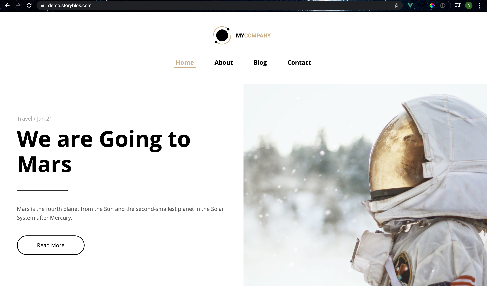

<p align="center">
  <h1 align="center">Gridsome Website by Storyblok</h1>
</p>



Check the website [here](https://demo.storyblok.com/).

## Installation

Clone this project with:

```sh
$ git clone https://github.com/storyblok/gridsome-multilanguage-website.git
```

### Install all dependencies

```sh
$ yarn # or npm install
```

## Storyblok client configuration

To configure the Storyblok client we have to change the access Token, to get the token you need a [Storyblok account](https://app.storyblok.com/#!/), now that you have the token, we will go to the `gridsome.config.js` file and change the token, the file is at the root of the project:

```js
  // in gridsome.config.js
  module.exports = {
    siteName: 'Gridsome Multilanguage Website',
    plugins: [
      {
        use: 'gridsome-source-storyblok',
        options: {
          client: {
            accessToken: '<Your_Access_Token_Here>'
          },
          version: 'published',
          params: {resolve_relations: 'blog-post.next_post'},
          downloadImages: true,
          imageDirectory: 'assets/images'
        }
      }
    ],
  }
```

For more information about our Gridsome plugin, visit the Github [repository](https://github.com/storyblok/gridsome-source-storyblok#gridsome-source-storyblok).

### Run project in develop mode

```sh
$ yarn develop # or npm run develop
```

### Build the project

```sh
$ yarn build # or npm run build
```

### Storyblok Preview Location Configuration

See how to set up your location [here](https://www.storyblok.com/tp/gridsome-multilanguage-website-tutorial#add-the-editor-page).

---

<p align="center">
  <h5 align="center">Powered by <a href="https://www.storyblok.com/" title="link to the Storyblok website">Storyblok</a></h5>
</p>
